<!-- 床の間 — the alcove where a single object is placed, and contemplated. -->

  

<!-- SEPARATOR -->

  

<!-- /SEPARATOR -->

<!-- SKILLSET -->

  

<!-- /SKILLSET -->

 

  <code>references</code> &nbsp;·&nbsp; <a href="https://www.sayna.app/">sayna.app</a> &nbsp;·&nbsp; <a href="https://github.com/LoloMutekai/kairo-alcove">the exposed alcove</a> &nbsp;·&nbsp; <code>the rest lives offline</code>

