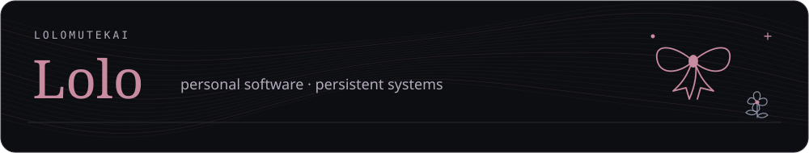

  

# Lolo ♡

[Explore Kairo ↗](https://lolomutekai.github.io/kairo-alcove/) · [Read the technical notebook](https://github.com/LoloMutekai/kairo-alcove)

I build **A.C.C.E.S.S.**, a personal AI system with state that persists between
conversations. My current interests are private state, explicit sharing and
the gap between an event being produced and its effect being observed.

## How I work

AI is part of my workflow: exploration, implementation and review. I keep
project-specific learning journals, bug write-ups and verification notes to
build my own understanding and keep the work explainable. I take responsibility
for what I publish.

## Work you can examine

The [public notebook](https://github.com/LoloMutekai/kairo-alcove) contains an
independent reference model, mathematical arguments and runnable checks:

- **Isolation:** compare executions that differ in private state.
- **Delivery:** state the fairness assumption and exhibit starvation without it.
- **Stability:** separate initial-state error from accumulated input error.

The private implementation and the public model are separate artifacts.
Each note states its assumptions, evidence and limits.

## A little background

At 16, while still in secondary school, I was discussing market regimes,
order flow and multi-strategy approaches with people working on quantitative
trading projects, and was invited to join a quant trading group.

## The Kairo collection

| Project | What you can inspect |
| --- | --- |
| [A.C.C.E.S.S. notebook](https://github.com/LoloMutekai/kairo-alcove) | Formal notes, executable specification and counterexamples. |
| [Sayna](https://www.sayna.app/) | A clinic-branded patient app and management dashboard for aesthetic clinics. |
| Unicorn | Collaborator discovery through skills and projects; in development. |
| Maestrale | A long-term military simulation ambition in Unreal Engine. |
| Tokonoma & the residence | A personal interface language and an interactive spatial desktop on Arch Linux, under construction. |

The [interactive Kairo showcase](https://lolomutekai.github.io/kairo-alcove/)
brings these projects together, with product introductions, a layered sculpture
and a floral background that responds to the pointer.

I also care about the place software lives: dark ink, dusty rose, small ribbons
and kawaii interfaces. The same palette runs through the notebook.

---

床の間 · persistent systems, personal software, a little pink ♡

